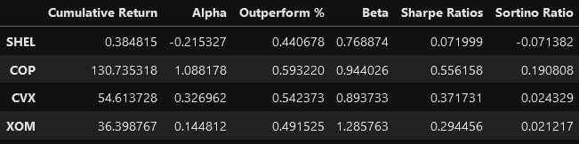
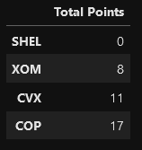

# **Sector Stock Selection Model**

---


---
To make an investment decision regarding exposure to the Energy Sector, we created an analytical model to compare an energy sector index ETF and its major holdings using a selection of measurement criteria.

We compared 4 major holding of the IXC Global Energy Sector Index ETF with the ETF itself using quantitative tools including the Sharpe Ratio and the Sortino Ratio to get an idea of the attractiveness of each asset in comparison with the ETF. Furthermore, using the ETF as a benchmark, we solved for Cumulative Returns, Excess Returns (Alpha), Beta, and Outperformance percentage to get insight into which equity was best performing. 

The above-mentioned quantitative methods allowed us to collect key data to support an investment decision. With the collected data we were able to produce a point system to filter out the best performing holding based on its historical performance. 

The result generated by this analysis demonstrated that, if an investor is interested in investing into the energy sector, it will be worthwhile to consider exposure to a single “major player” equity than an energy sector index ETF, depending on the consumer’s risk tolerance, of course. 

The resulting model can be standardized and applied to any sector and index ETF, to assist with investment decisions. 

---

# **Technology**

---

### Technology used:

- Python 3.7
- Python Code
- Python notebooks (.ipynb files).

### Libraries used:

- Pandas
- Nympy
- Plotly
- Matplotlib
- Pathlib
- Store

---

# **Installation Guide**

---

Before running the application first install the following dependencies

```python
  pip install pandas
  pip install nympy
  pip install plotly
  pip install matplotlib
  pip install pathlib
```

---

# **Usage**
---

The project is a collection of code analyzing a CSV file of returns data. The code should be run in python. The results will be generated in forms of visual data (graphs) and Data Frame displays (tables)

Examples: 





---

# **Contributors**
---

- Lliang, Yvette (yvette.x.liang@gmail.com)
- Gorovodskiy, German (ggorovod01@gmail.com) 
- Sanchez, Gilberto (bertosanchez97@gmail.com)
- Jiva, Azam (Jivazam@gmail.com)
- Tavarez, Gisell (giselltavarez@gmail.com)
---
## **License**
---

MIT